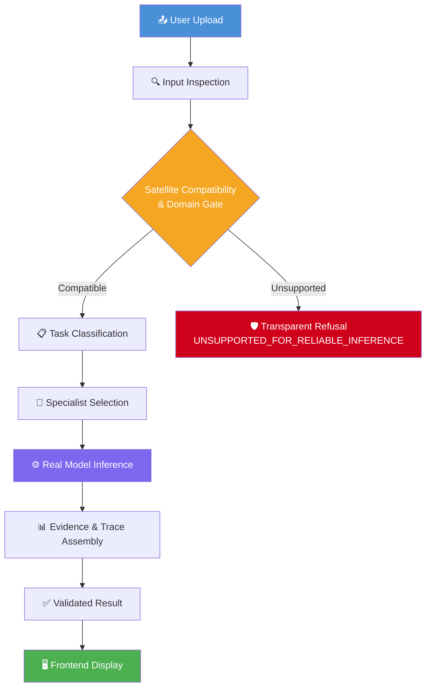

<p align="center">
  
  
  
  
  
  
</p>

<h1 align="center">🛰️ SatQuery-AI</h1>

<p align="center">
  <strong>AI-Powered Multimodal Satellite Imagery Intelligence Platform</strong><br/>
  <em>Query satellite images in natural language. Detect changes across time. Fuse optical &amp; radar sensors. All powered by real deep learning.</em>
</p>

<p align="center">
  <a href="#-features">Features</a> •
  <a href="#%EF%B8%8F-system-architecture">Architecture</a> •
  <a href="#-end-to-end-workflow">Workflow</a> •
  <a href="#-getting-started">Getting Started</a> •
  <a href="#-model-zoo--benchmarks">Benchmarks</a> •
  <a href="#-team">Team</a>
</p>

---

## ✨ Features

<table>
<tr>
<td width="50%">

### 🔍 Natural Language VQA
Ask questions about satellite imagery in plain English. Powered by **SmolVLM-500M-Instruct** with a domain-adapted **LoRA checkpoint** fine-tuned on remote sensing data.

</td>
<td width="50%">

### 🔄 Bi-Temporal Change Detection
Upload Before/After satellite image pairs and detect structural changes with a trained **Siamese U-Net** (490K params, LEVIR-CD trained). Generates real binary change masks with quantitative statistics.

</td>
</tr>
<tr>
<td width="50%">

### 🌐 Optical + SAR Fusion
Combine Sentinel-2 optical and Sentinel-1 SAR radar imagery through a **Dual-Branch Gated Multimodal Fusion** network. Computes calibrated radar backscatter physics (σ₀ dB), polarimetric cross-ratios, and false-color composites.

</td>
<td width="50%">

### 🛡️ Scientific Integrity
Zero fabricated metrics. All models return `confidence: null` when uncalibrated. Out-of-domain inputs trigger transparent **Domain Gate refusal** instead of misleading predictions. Detector telemetry is strictly separated from VLM interpretation.

</td>
</tr>
</table>

---

## 🏗️ System Architecture

```
┌──────────────────────────────────────────────────────────────────────────┐
│                        SatQuery-AI Platform                             │
├──────────────────────────────────────────────────────────────────────────┤
│                                                                          │
│  ┌─────────────────────────────────────────────────────────────────┐     │
│  │                    Frontend (Next.js 16)                         │     │
│  │  ┌──────────┐  ┌──────────┐  ┌──────────┐  ┌──────────────┐   │     │
│  │  │  Upload   │  │ Analysis │  │ Registry │  │  Benchmark   │   │     │
│  │  │  Portal   │  │  Viewer  │  │  Panel   │  │  Dashboard   │   │     │
│  │  └─────┬────┘  └────┬─────┘  └──────────┘  └──────────────┘   │     │
│  └────────┼─────────────┼──────────────────────────────────────────┘     │
│           │             │                                                │
│           ▼             ▼                                                │
│  ┌─────────────────────────────────────────────────────────────────┐     │
│  │                   FastAPI Backend (Port 8000)                    │     │
│  │                                                                   │     │
│  │  ┌──────────────────────────────────────────────────────────┐    │     │
│  │  │               Satellite Compatibility Layer               │    │     │
│  │  │  Image Inspector → Spatial Validator → Domain Gate        │    │     │
│  │  └──────────────────────────┬───────────────────────────────┘    │     │
│  │                             │                                     │     │
│  │  ┌──────────────────────────▼───────────────────────────────┐    │     │
│  │  │            Task Classifier & Orchestrator                 │    │     │
│  │  │   Query Analysis → Tool Selection → Parallel Dispatch     │    │     │
│  │  └────┬──────────────┬──────────────┬───────────────────────┘    │     │
│  │       │              │              │                             │     │
│  │       ▼              ▼              ▼                             │     │
│  │  ┌─────────┐  ┌───────────┐  ┌──────────────┐                   │     │
│  │  │ RS-VQA  │  │  Change   │  │ Optical+SAR  │                   │     │
│  │  │ SmolVLM │  │ Detector  │  │   Fusion     │                   │     │
│  │  │ + LoRA  │  │ Siamese   │  │ Dual-Branch  │                   │     │
│  │  │         │  │  U-Net    │  │   Gated Net  │                   │     │
│  │  └─────────┘  └───────────┘  └──────────────┘                   │     │
│  │                                                                   │     │
│  │  ┌──────────────────────────────────────────────────────────┐    │     │
│  │  │           Evidence & Trace Assembly Engine                │    │     │
│  │  │  Provenance Tracking → Result Validation → UI Rendering   │    │     │
│  │  └──────────────────────────────────────────────────────────┘    │     │
│  └─────────────────────────────────────────────────────────────────┘     │
└──────────────────────────────────────────────────────────────────────────┘
```

---

## 🔄 End-to-End Workflow

The platform supports three primary analysis modes. Each follows the same rigorous pipeline:

### Pipeline Flow



### Mode 1 — Single Image VQA

```
Upload Satellite Image
    → Metadata Extraction (format, bands, CRS, modality)
    → Compatibility Check (sensor, resolution, domain)
    → Task Classification (VQA / Captioning)
    → SmolVLM-500M-Instruct + LoRA Inference
    → Natural Language Answer + Evidence Chain
```

### Mode 2 — Bi-Temporal Change Detection & Change VQA

```
Upload Before (T1) + After (T2) Images
    → Pairwise Inspection & Temporal Validation
    → Domain Gate (LEVIR-CD compatibility check)
    → Siamese U-Net Change Detection (binary mask, % changed, severity)
    → 2-Panel Composite Generation (T1 | T2)
    → SmolVLM-500M + LoRA Temporal VQA
    → Semantic Validation (reject echoes, static descriptions, degenerate tokens)
    → Separated Report: Detector Telemetry ║ VLM Interpretation
```

### Mode 3 — Optical + SAR Cross-Modal Fusion

```
Upload Optical (Sentinel-2) + SAR (Sentinel-1) Images
    → GeoTIFF Metadata & CRS Extraction
    → Spatial Alignment & Resampling
    → SAR Polarimetric Physics (σ₀ dB, VH/VV ratio, specular/double-bounce)
    → Dual-Branch Gated Fusion Network
    → False-Color Composite Synthesis
    → Joint Cross-Modal Analysis Report
```

---

## 🚀 Getting Started

### Prerequisites

- **Node.js** ≥ 18.x
- **Python** ≥ 3.11
- **Git**

### 1. Clone & Install Frontend

```bash
git clone https://github.com/siddhtyagi18/SatQuery-AI.git
cd SatQuery-AI

# Configure frontend environment
cp .env.example .env.local

# Install and launch
npm install
npm run dev
# ➜ Frontend: http://localhost:3000
```

### 2. Setup Backend

```bash
# In a new terminal
cd backend

# Create virtual environment
python -m venv .venv

# Activate (Windows PowerShell)
.\.venv\Scripts\Activate.ps1
# Activate (Linux/macOS)
# source .venv/bin/activate

# Install dependencies
pip install -r requirements.txt

# Configure environment
cp .env.example .env
```

### 3. Configure & Launch

Edit `backend/.env`:

```env
# Change Detection Checkpoint (included in repo, ~1.5 MB)
CHANGE_DETECTION_CHECKPOINT=./checkpoints/best_model.pt

# VQA Mode: "real" (SmolVLM + LoRA), "mock" (fast dev), "auto" (hybrid)
VQA_MODE=real
AI_PROVIDER=local

# Optional: Local LEVIR-CD dataset path for training/evaluation
# LEVIR_CD_DATASET_PATH=/path/to/LEVIR-CD
```

```bash
# Start the backend server
uvicorn app.main:app --host 127.0.0.1 --port 8000
# ➜ API Docs: http://localhost:8000/docs
# ➜ Health:   http://localhost:8000/health
```

### 4. Run Tests

```bash
cd backend
pytest -v
# ➜ 213 tests passed ✅
```

---

## 🏆 Model Zoo & Benchmarks

### Change Detection — Siamese U-Net (LEVIR-CD)

Trained across **7 experiments** with progressively refined architectures and loss functions:

| Experiment | Params | Epochs | Loss | Best Val F1 | Best Val IoU | Status |
|:---|:---:|:---:|:---|:---:|:---:|:---:|
| **Baseline** | 490,561 | 50 | BCE + Dice | 0.5429 | 0.4875 | ✅ |
| **experiment_01** | 490,561 | 50 | Hybrid Imbalance | 0.6245 | 0.4638 | ✅ |
| **experiment_02** | 119,025 | 5 | hybrid_v2 | 0.4116 | 0.2651 | ✅ |
| **experiment_03** 🏆 | 119,025 | 60 | hybrid_v2 | **0.6435** | **0.4776** | ✅ |
| **experiment_04** | 119,025 | 75 | hybrid_v2 | 0.6401 | 0.4738 | ✅ |
| **experiment_controlled** | 119,025 | 51 | hybrid_v2 | 0.6278 | 0.4604 | ✅ |

#### Official Test Evaluation (Baseline Checkpoint, 128-Sample LEVIR-CD Test Split)

| Metric | Score |
|:---|:---:|
| **Test Micro IoU** | 58.06% |
| **Test Micro F1 / Dice** | 73.47% |
| **Test Precision** | 73.62% |
| **Test Recall** | 73.32% |
| **Test Pixel Accuracy** | 97.34% |

### Vision-Language Model — SmolVLM-500M-Instruct + LoRA

| Component | Detail |
|:---|:---|
| **Base Model** | HuggingFaceTB/SmolVLM-500M-Instruct |
| **Adaptation** | PEFT LoRA checkpoint (`vqa_lora_experiment_01/best`) |
| **Domain** | Remote Sensing Visual Question Answering |
| **Device** | CPU / CUDA (automatic fallback) |
| **Confidence** | `null` (uncalibrated — scientifically honest) |

### Optical + SAR Fusion — OpticalSARFusionNet

| Component | Detail |
|:---|:---|
| **Architecture** | Dual-Branch Gated Multimodal Fusion |
| **Optical Input** | Sentinel-2 B02/B03/B04/B08 (4-channel) |
| **SAR Input** | Sentinel-1 VV/VH (2-channel) |
| **Embedding Dim** | 128 |
| **Verification** | N=2 authentic BigEarthNet S1/S2 pairs |

---

## 🔬 Specialist Tool Registry

| Specialist | Status | Engine | Domain |
|:---|:---:|:---|:---|
| **RS-VQA** | 🟢 Real | SmolVLM-500M + LoRA | Optical / Multispectral VQA & Captioning |
| **Change Detector** | 🟢 Real | Siamese U-Net (best_model.pt) | LEVIR-CD Building/Structural Change |
| **Change VQA** | 🟢 Real | SmolVLM + LoRA + Siamese U-Net | Bi-Temporal Scene Interpretation |
| **Optical+SAR Analyzer** | 🟢 Real | Dual-Branch Gated Fusion | Sentinel-1/Sentinel-2 Cross-Modal |
| **RS Captioning** | 🟢 Real | SmolVLM + LoRA | Remote Sensing Scene Description |
| **RS Grounding** | 🟡 Mock | Structured Mock | Object Detection (Phase 2) |
| **Spatial Analyzer** | 🟡 Mock | Structured Mock | Zonal Statistics (Phase 2) |

---

## 📂 Project Structure

```
SatQuery-AI/
├── 🖥️  app/                         # Next.js 16 Frontend (App Router)
│   ├── analysis/                    # Analysis submission, history & detail views
│   ├── benchmark/                   # Model benchmark dashboard
│   ├── registry/                    # Specialist tool registry inspector
│   ├── login/                       # Authentication & access control
│   ├── page.tsx                     # Landing page with orbital HUD
│   └── layout.tsx                   # Root layout with theme provider
│
├── 🧩  components/                   # Reusable React UI components
│   ├── SatelliteViewer              # Image comparison & overlay viewer
│   ├── ChangeStatsPanel             # Change detection statistics display
│   └── ExecutionTrace               # Step-by-step execution trace viewer
│
├── 📡  backend/                      # FastAPI Backend Service
│   ├── app/
│   │   ├── routers/                 # API endpoints (upload, analysis, tools, health)
│   │   ├── services/                # Core ML services
│   │   │   ├── orchestrator.py      # Task classification & specialist dispatch
│   │   │   ├── vqa_service.py       # VLM inference pipeline (SmolVLM + LoRA)
│   │   │   ├── model_inference.py   # Siamese U-Net change detection engine
│   │   │   ├── change_vqa.py        # Temporal VQA with semantic validation
│   │   │   ├── optical_sar.py       # SAR physics & cross-modal fusion
│   │   │   ├── satellite_compatibility.py  # Domain gate & input validation
│   │   │   └── models/              # Neural network architectures
│   │   ├── main.py                  # FastAPI app entry point
│   │   ├── config.py                # Pydantic settings
│   │   └── schemas.py               # API request/response schemas
│   │
│   ├── checkpoints/                 # Trained model weights (~1.5 MB each)
│   │   ├── best_model.pt            # Production checkpoint
│   │   ├── experiment_03/           # 🏆 Best experiment (F1=0.6435)
│   │   └── vqa_lora_experiment_01/  # LoRA adapter weights
│   │
│   ├── tests/                       # 213 automated tests
│   ├── scripts/                     # Training, evaluation & CLI tools
│   └── data/                        # Upload storage & result artifacts
│
├── 📚  lib/                          # API client & TypeScript interfaces
├── 📊  evaluation_results/           # Quantitative benchmark reports
└── 📋  README.md
```

---

## 🏋️ Training & Evaluation

### Run Test Split Evaluation

```bash
cd backend
python scripts/evaluate_full_test_and_val.py \
    --checkpoint ./checkpoints/best_model.pt \
    --data-root /path/to/LEVIR-CD \
    --threshold 0.70
```

### Generate Prediction Visualizations

```bash
python scripts/visualize_change_predictions.py \
    --checkpoint ./checkpoints/best_model.pt \
    --data-root /path/to/LEVIR-CD \
    --num-samples 10 --threshold 0.70
```

### Resume Training

```bash
python scripts/train_change_detector.py \
    --data-root /path/to/LEVIR-CD \
    --resume ./checkpoints/last_model.pt \
    --epochs 100 --batch-size 4
```

---

## ⚠️ Known Limitations & Scientific Honesty

> [!IMPORTANT]
> SatQuery-AI is designed with scientific integrity as a core principle. The system will **never** fabricate confidence scores, accuracy percentages, or generate misleading predictions on unsupported data.

| Limitation | How the System Handles It |
|:---|:---|
| Change Detection is trained on **LEVIR-CD only** (building/structural change, high-res optical) | Domain Gate refuses out-of-domain inputs with `UNSUPPORTED_FOR_RELIABLE_INFERENCE` |
| VLM temporal reasoning produces **independent panel descriptions** instead of comparative transitions | Validator flags as `INSUFFICIENT_TEMPORAL_REASONING`; honest notice displayed to user |
| Optical+SAR fusion verified on **N=2 Sentinel pairs** only | Smoke-test limitation clearly declared; no universal cross-sensor claims |
| Confidence scores are **not calibrated** | All models return `confidence: null` — never a fabricated percentage |
| RS Grounding & Spatial Analyzer are **mock services** | Clearly labeled `[MOCK]` in UI and registry |

---

## 💾 Model Weights & Storage

- **Siamese U-Net checkpoints** (~1.5 MB each) are versioned directly in Git under `backend/checkpoints/`
- **LoRA adapter weights** are stored under `backend/checkpoints/vqa_lora_experiment_01/`
- **SmolVLM-500M-Instruct** base model is downloaded automatically from HuggingFace on first run
- **Datasets** (LEVIR-CD, BigEarthNet) are excluded from Git via `.gitignore` — configure paths in `.env`

---

## 📜 License

This project was developed for the **Smart India Hackathon (SIH)**.

---

<br/>

<h2 align="center">👥 Team</h2>

<p align="center">
  <strong>Built with ❤️ for the Smart India Hackathon</strong>
</p>

<table align="center">
<tr>
  <td align="center"><strong>Siddh Tyagi</strong></td>
  <td align="center"><strong>Pratha Varshney</strong></td>
  <td align="center"><strong>Niharika Swain</strong></td>
</tr>
<tr>
  <td align="center"><strong>Rehan Raza</strong></td>
  <td align="center"><strong>Pranjal Gupta</strong></td>
  <td align="center"><strong>Shantany Yadav</strong></td>
</tr>
</table>

<br/>

<p align="center">
  <em>SatQuery-AI — Smart India Hackathon (SIH) 2024</em><br/>
  <sub>🛰️ Querying the Earth, one pixel at a time.</sub>
</p>
