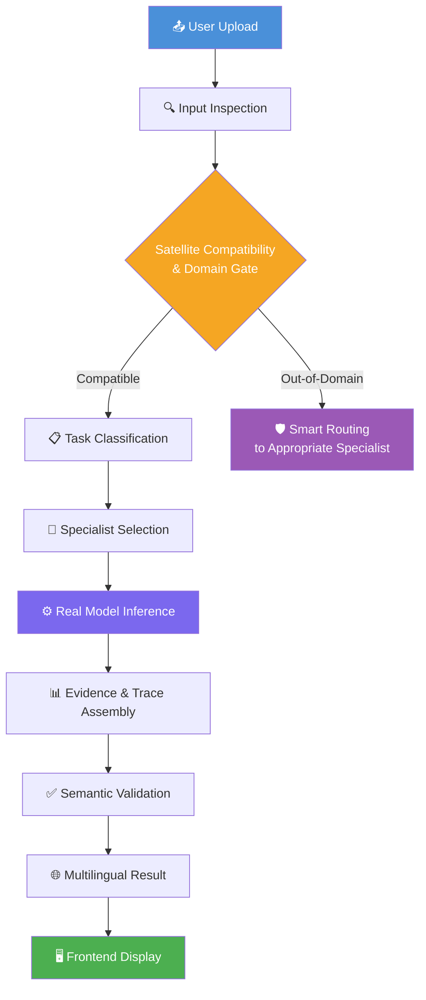

<p align="center">
  
  
  
  
  
  
  
</p>

<h1 align="center">🛰️ SatQuery-AI</h1>

<p align="center">
  <strong>AI-Powered Multimodal Satellite Imagery Intelligence Platform</strong><br/>
  <em>Ask questions about satellite images in natural language · Detect changes across time · Fuse optical &amp; radar sensors<br/>
  Built with real deep learning models — no simulations, no shortcuts.</em>
</p>

<p align="center">
  <a href="#-features">Features</a> •
  <a href="#️-system-architecture">Architecture</a> •
  <a href="#-end-to-end-workflow">Workflow</a> •
  <a href="#-getting-started">Getting Started</a> •
  <a href="#-model-zoo--benchmarks">Benchmarks</a> •
  <a href="#-api-reference">API</a> •
  <a href="#-team">Team</a>
</p>

---

## ✨ Features

<table>
<tr>
<td width="50%">

### 🔍 Natural Language VQA
Ask questions about satellite imagery in plain **English or Hindi**. Powered by **SmolVLM-500M-Instruct** with a domain-adapted **LoRA checkpoint** fine-tuned on remote sensing data. Supports scene understanding, land-cover classification, and object identification.

</td>
<td width="50%">

### 🔄 Bi-Temporal Change Detection
Upload Before/After satellite image pairs and detect structural changes with a trained **Siamese U-Net** (119K–490K params, LEVIR-CD trained). Generates real binary change masks with quantitative statistics — pixel-level precision for urban monitoring.

</td>
</tr>
<tr>
<td width="50%">

### 🌐 Optical + SAR Cross-Modal Fusion
Combine **Sentinel-2** optical and **Sentinel-1** SAR radar imagery through a **Dual-Branch Gated Multimodal Fusion** network. Computes calibrated radar backscatter physics (σ₀ dB), polarimetric cross-ratios, and false-color composites for all-weather analysis.

</td>
<td width="50%">

### 🧠 Temporal Change VQA
Go beyond binary masks — ask natural language questions about **what changed and why**. The system combines Siamese U-Net detection with SmolVLM temporal reasoning to produce human-readable change narratives with rigorous semantic validation.

</td>
</tr>
<tr>
<td width="50%">

### 🚨 Disaster Assessment Mission Mode
Specialized rapid-response pipeline supporting **Flood, Earthquake, Wildfire, Cyclone, and Landslide** analysis with domain-specific damage metrics, impact zoning, and situational awareness reports.

</td>
<td width="50%">

### 📐 Geospatial Analytics & Physical Area
Calculates authentic ground change area in **hectares (ha) and m²** based on calibrated sensor GSD, quadrant spatial change density, and connected-component hotspot cluster ranking.

</td>
</tr>
<tr>
<td width="50%">

### 📄 PDF Mission Report Generator
Generates publication-grade **executive intelligence reports** with sensor apertures, quantitative analytics tables, hotspot localization maps, qualitative VLM interpretations, and operational verification caveats.

</td>
<td width="50%">

### 🛡️ Scientific Integrity & Zero Fabrication
Models without probabilistic calibration strictly report `confidence: null` in the backend and `N/A — Uncalibrated` in the UI — ensuring defensible intelligence for critical defense and disaster scenarios.

</td>
</tr>
<tr>
<td width="50%">

### 🌐 Multilingual Output
Analysis results are delivered in **English and Hindi** via an integrated multilingual translation layer, broadening accessibility for Indian government and defense use cases.

</td>
<td width="50%">

### 🤖 Multi-Provider AI Gateway
Pluggable AI provider backend supporting **Google Gemini**, **OpenRouter** (NVIDIA Nemotron), and fully **local SmolVLM** inference — with automatic fallback chains for high-availability operation.

</td>
</tr>
</table>

---

## 🏗️ System Architecture

```
┌──────────────────────────────────────────────────────────────────────────┐
│                        SatQuery-AI Platform                              │
├──────────────────────────────────────────────────────────────────────────┤
│                                                                          │
│  ┌──────────────────────────────────────────────────────────────────┐    │
│  │                    Frontend (Next.js 16 / Turbopack)              │    │
│  │  ┌──────────┐  ┌──────────┐  ┌──────────┐  ┌────────────────┐   │    │
│  │  │  Upload   │  │ Analysis │  │ Registry │  │   Benchmark    │   │    │
│  │  │  Portal   │  │  Viewer  │  │  Panel   │  │   Dashboard    │   │    │
│  │  └─────┬────┘  └────┬─────┘  └──────────┘  └────────────────┘   │    │
│  └────────┼─────────────┼────────────────────────────────────────────┘   │
│           │             │                                                │
│           ▼             ▼                                                │
│  ┌──────────────────────────────────────────────────────────────────┐    │
│  │                   FastAPI Backend (Port 8000)                     │    │
│  │                                                                   │    │
│  │  ┌─────────────────────────────────────────────────────────┐     │    │
│  │  │             Satellite Compatibility Layer                │     │    │
│  │  │   Image Inspector → Spatial Validator → Domain Gate      │     │    │
│  │  └──────────────────────────┬──────────────────────────────┘     │    │
│  │                             │                                     │    │
│  │  ┌──────────────────────────▼──────────────────────────────┐     │    │
│  │  │          Task Classifier & Orchestrator                  │     │    │
│  │  │   Query Analysis → Tool Selection → Parallel Dispatch    │     │    │
│  │  └────┬──────────────┬───────────────┬─────────────────────┘     │    │
│  │       │              │               │                            │    │
│  │       ▼              ▼               ▼                            │    │
│  │  ┌─────────┐  ┌───────────┐  ┌──────────────┐  ┌─────────────┐  │    │
│  │  │ RS-VQA  │  │  Change   │  │ Optical+SAR  │  │  Mission    │  │    │
│  │  │ SmolVLM │  │ Detector  │  │   Fusion     │  │  Report     │  │    │
│  │  │ + LoRA  │  │ Siamese   │  │ Dual-Branch  │  │  Generator  │  │    │
│  │  │         │  │  U-Net    │  │  Gated Net   │  │             │  │    │
│  │  └─────────┘  └───────────┘  └──────────────┘  └─────────────┘  │    │
│  │                                                                   │    │
│  │  ┌─────────────────────────────────────────────────────────┐     │    │
│  │  │          Evidence & Trace Assembly Engine                │     │    │
│  │  │   Provenance Tracking → Validation → Multilingual UI     │     │    │
│  │  └─────────────────────────────────────────────────────────┘     │    │
│  │                                                                   │    │
│  │  ┌──────────────────┐   ┌──────────────┐   ┌─────────────────┐   │    │
│  │  │  SQLite / Local  │   │   Firebase   │   │ AI Provider     │   │    │
│  │  │   Storage        │   │ (Optional)   │   │ Gemini/OpenRtr  │   │    │
│  │  └──────────────────┘   └──────────────┘   └─────────────────┘   │    │
│  └───────────────────────────────────────────────────────────────────┘   │
└──────────────────────────────────────────────────────────────────────────┘
```

---

## 🔄 End-to-End Workflow

The platform supports four primary analysis modes. Each follows the same rigorous pipeline:



### Mode 1 — Single Image VQA

```
Upload Satellite Image (JPEG / PNG / GeoTIFF)
    → Metadata Extraction (format, bands, CRS, modality)
    → Compatibility Check (sensor, resolution, domain gate)
    → Task Classification (VQA / Captioning)
    → SmolVLM-500M-Instruct + LoRA Inference
    → Natural Language Answer + Evidence Chain
    → Multilingual Result (EN / HI)
```

### Mode 2 — Bi-Temporal Change Detection & Change VQA

```
Upload Before (T1) + After (T2) Images
    → Pairwise Inspection & Temporal Validation
    → Siamese U-Net Change Detection (binary mask, % changed, severity)
    → 2-Panel Composite Generation (T1 | T2)
    → Geospatial Change Analytics (hectares, hotspot clusters, quadrant distribution)
    → SmolVLM-500M + LoRA Temporal VQA
    → Semantic Validation (reject echoes, static descriptions, degenerate tokens)
    → Separated Report: Detector Telemetry ║ VLM Interpretation
    → PDF Mission Report (optional)
```

### Mode 3 — Optical + SAR Cross-Modal Fusion

```
Upload Optical (Sentinel-2) + SAR (Sentinel-1) Images
    → GeoTIFF Metadata & CRS Extraction
    → Spatial Alignment & Resampling
    → SAR Polarimetric Physics (σ₀ dB, VH/VV ratio, specular/double-bounce)
    → Dual-Branch Gated Fusion Network
    → False-Color Composite Synthesis (RGB, NDVI, moisture)
    → Joint Cross-Modal Analysis Report
```

### Mode 4 — Disaster Assessment Mission Mode

```
Upload Mission Imagery + Select Disaster Type
    → Domain-Specialized Analysis (Flood / Earthquake / Wildfire / Cyclone / Landslide)
    → Damage Zoning & Severity Estimation
    → Geospatial Impact Metrics
    → Rapid Situational Awareness PDF Report
```

---

## 🚀 Getting Started

### Prerequisites

| Requirement | Version |
|:---|:---:|
| **Node.js** | ≥ 18.x |
| **Python** | ≥ 3.11 |
| **Git** | latest |

### 1. Clone & Install Frontend

```bash
git clone https://github.com/siddhtyagi18/SatQuery-AI.git
cd SatQuery-AI

# Configure frontend environment
cp .env.example .env.local
# Edit .env.local — set NEXT_PUBLIC_API_URL=http://localhost:8000

# Install dependencies
npm install

# Start dev server
npm run dev
# ➜ Frontend: http://localhost:3000
```

### 2. Setup Backend

```bash
# In a new terminal
cd backend

# Create and activate virtual environment
python -m venv .venv

# Windows PowerShell
.\.venv\Scripts\Activate.ps1

# Linux / macOS
# source .venv/bin/activate

# Install dependencies
pip install -r requirements.txt

# Configure environment
cp .env.example .env
```

### 3. Configure Environment

Edit `backend/.env` with your settings:

```env
# ── Core ──────────────────────────────────────────────
VQA_MODE=real           # "real" | "auto" | "mock"
AI_PROVIDER=auto        # "auto" | "gemini" | "openrouter" | "local"
DATABASE_URL=sqlite:///./satquery.db
UPLOAD_DIR=./uploads

# ── Change Detection Model ─────────────────────────────
CHANGE_DETECTION_CHECKPOINT=./checkpoints/best_model.pt

# ── AI Provider Keys (at least one recommended) ────────
GEMINI_API_KEY=your_gemini_api_key_here
OPENROUTER_API_KEY=your_openrouter_api_key_here

# ── Optional: Dataset Paths (for training/evaluation) ──
# LEVIR_CD_ROOT=/path/to/LEVIR-CD
# BIGEARTHNET_TXT_PARQUET=/path/to/BigEarthNet.txt.parquet
```

### 4. Launch Backend

```bash
cd backend
uvicorn app.main:app --host 127.0.0.1 --port 8000

# ➜ API Docs:    http://localhost:8000/docs
# ➜ Health:      http://localhost:8000/health
# ➜ API Root:    http://localhost:8000/
```

### 5. Run Tests

```bash
cd backend
pytest -v
# ➜ 294 tests passed ✅  (100% pass rate)
```

> **Tip:** The SmolVLM-500M-Instruct base model is automatically downloaded from HuggingFace on first run (~1.5 GB). Ensure a stable internet connection for the initial startup.

---

## 🏆 Model Zoo & Benchmarks

### Change Detection — Siamese U-Net (LEVIR-CD)

Trained across **7 experiments** with progressively refined architectures and loss functions on the LEVIR-CD building change detection dataset:

| Experiment | Params | Epochs | Loss Function | Best Val F1 | Best Val IoU | Status |
|:---|:---:|:---:|:---|:---:|:---:|:---:|
| **Baseline** | 490,561 | 50 | BCE + Dice | 0.5429 | 0.4875 | ✅ |
| **experiment_01** | 490,561 | 50 | Hybrid Imbalance | 0.6245 | 0.4638 | ✅ |
| **experiment_02** | 119,025 | 5 | hybrid_v2 | 0.4116 | 0.2651 | ✅ |
| **experiment_03** 🏆 | 119,025 | 60 | hybrid_v2 | **0.6435** | **0.4776** | ✅ |
| **experiment_04** | 119,025 | 75 | hybrid_v2 | 0.6401 | 0.4738 | ✅ |
| **experiment_controlled** | 119,025 | 51 | hybrid_v2 | 0.6278 | 0.4604 | ✅ |

#### Official Test Evaluation — 128-Sample LEVIR-CD Test Split

| Metric | Score |
|:---|:---:|
| **Test Micro IoU** | 58.06% |
| **Test Micro F1 / Dice** | 73.47% |
| **Test Precision** | 73.62% |
| **Test Recall** | 73.32% |
| **Test Pixel Accuracy** | 97.34% |

### Vision-Language Model — SmolVLM-500M-Instruct + LoRA

| Component | Detail |
|:---|:---|
| **Base Model** | `HuggingFaceTB/SmolVLM-500M-Instruct` |
| **Adaptation** | PEFT LoRA checkpoint (`vqa_lora_experiment_01/best`) |
| **Domain** | Remote Sensing Visual Question Answering |
| **Capabilities** | Scene understanding, land-cover analysis, temporal reasoning |
| **License** | Apache 2.0 |
| **Device** | CPU / CUDA (automatic detection & fallback) |
| **Max New Tokens** | 512 |

### Optical + SAR Fusion — OpticalSARFusionNet

| Component | Detail |
|:---|:---|
| **Architecture** | Dual-Branch Gated Multimodal Fusion |
| **Optical Input** | Sentinel-2 B02/B03/B04/B08 (4-channel) |
| **SAR Input** | Sentinel-1 VV/VH (2-channel) |
| **Embedding Dim** | 128 |
| **Physics Layer** | Calibrated σ₀ dB backscatter + VH/VV polarimetric ratio |
| **Output** | Fused feature maps + RGB false-color composites |

---

## 🔬 Specialist Tool Registry

| Specialist | Status | Engine | Domain |
|:---|:---:|:---|:---|
| **RS-VQA** | 🟢 Active | SmolVLM-500M-Instruct + LoRA | Optical / Multispectral VQA |
| **Change Detector** | 🟢 Active | Siamese U-Net (`best_model.pt`) | LEVIR-CD Building Change |
| **Change VQA** | 🟢 Active | SmolVLM + LoRA + Siamese U-Net | Bi-Temporal Scene Interpretation |
| **Optical+SAR Analyzer** | 🟢 Active | Dual-Branch Gated Fusion | Sentinel-1/Sentinel-2 Fusion |
| **RS Captioning** | 🟢 Active | SmolVLM + LoRA | Remote Sensing Scene Description |
| **Mission Report** | 🟢 Active | PDF Generator + VLM | Executive Intelligence Reports |
| **Geospatial Analytics** | 🟢 Active | GSD-calibrated Engine | Physical Area & Hotspot Clustering |
| **Disaster Assessment** | 🟢 Active | Specialized Pipeline | Flood / EQ / Fire / Cyclone / Landslide |
| **RS Grounding** | 🔵 Planned | Deep Feature Extractor | Object Detection & Localization |
| **Spatial Analyzer** | 🔵 Planned | Geospatial Engine | Zonal Statistics & Spatial Queries |

---

## 📂 Project Structure

```
SatQuery-AI/
├── 🖥️  app/                          # Next.js 16 Frontend (App Router)
│   ├── analysis/                     # Analysis submission, history & detail views
│   ├── benchmark/                    # Model benchmark dashboard
│   ├── registry/                     # Specialist tool registry inspector
│   ├── login/                        # Authentication & access control
│   ├── profile/                      # User profile
│   ├── auth/                         # Auth callbacks
│   ├── page.tsx                      # Landing page with orbital HUD
│   ├── layout.tsx                    # Root layout with theme provider
│   └── globals.css                   # Global design system & animations
│
├── 🧩  components/                    # Reusable React UI components
│
├── 📡  backend/                       # FastAPI Backend Service
│   ├── app/
│   │   ├── main.py                   # FastAPI entry point & middleware
│   │   ├── config.py                 # Pydantic settings (env-driven)
│   │   ├── schemas.py                # API request/response schemas
│   │   ├── models.py                 # SQLAlchemy ORM models
│   │   ├── database.py               # SQLite / DB session
│   │   ├── crud.py                   # Database CRUD operations
│   │   ├── routers/                  # API route handlers
│   │   │   ├── analysis.py           # Core analysis endpoints
│   │   │   ├── upload.py             # Image upload handling
│   │   │   ├── datasets.py           # Dataset management & validation
│   │   │   ├── benchmark.py          # Benchmark API
│   │   │   ├── health.py             # Health check endpoint
│   │   │   ├── tools.py              # Tool registry API
│   │   │   └── files.py              # Static file serving
│   │   └── services/                 # Core ML & business logic
│   │       ├── orchestrator.py       # Task classification & dispatch
│   │       ├── vqa_service.py        # SmolVLM + LoRA inference pipeline
│   │       ├── vqa_adapter.py        # VQA model adapter layer
│   │       ├── model_inference.py    # Siamese U-Net change detection
│   │       ├── change_detection.py   # Change detection service
│   │       ├── change_vqa.py         # Temporal VQA with validation
│   │       ├── optical_sar.py        # SAR physics & fusion network
│   │       ├── satellite_compatibility.py  # Domain gate & validation
│   │       ├── geospatial_change_analytics.py  # Physical area computation
│   │       ├── roi_change_analytics.py     # ROI-level analytics
│   │       ├── mission_report.py     # PDF report generator
│   │       ├── ai_provider.py        # Multi-provider AI gateway
│   │       ├── multilingual.py       # EN/HI translation layer
│   │       ├── result_validation.py  # Semantic output validation
│   │       ├── follow_up.py          # Follow-up query handling
│   │       ├── task_classifier.py    # Query intent classification
│   │       ├── tool_registry.py      # Specialist tool registry
│   │       ├── metadata.py           # Image metadata extraction
│   │       ├── preprocessing.py      # Image preprocessing utilities
│   │       ├── model_manager.py      # Model lifecycle management
│   │       ├── firebase.py           # Firebase integration (optional)
│   │       ├── trace.py              # Execution trace assembly
│   │       ├── mock_specialists.py   # Mock specialist stubs
│   │       ├── image_analysis.py     # Image analysis utilities
│   │       └── models/               # Neural network architectures
│   │
│   ├── checkpoints/                  # Trained model weights
│   │   ├── best_model.pt             # Production Siamese U-Net (~1.5 MB)
│   │   ├── last_model.pt             # Latest training checkpoint
│   │   ├── baseline_epoch48_best_model.pt
│   │   ├── experiment_01/ … experiment_04/   # Experiment checkpoints
│   │   ├── experiment_controlled/
│   │   ├── vqa_lora_experiment_01/   # LoRA adapter weights (production)
│   │   ├── vqa_lora_smoke/
│   │   └── training_log.json         # Full training history
│   │
│   ├── tests/                        # 28 test files — 294 automated tests
│   ├── scripts/                      # Training, evaluation & CLI tools
│   ├── data/                         # Upload storage & result artifacts
│   ├── requirements.txt
│   └── .env.example                  # Environment configuration template
│
├── 📚  lib/                           # TypeScript API client & interfaces
├── 📊  evaluation_results/            # Quantitative benchmark reports
├── 📖  docs/                          # Additional documentation
├── next.config.ts                    # Next.js configuration
├── package.json
└── README.md
```

---

## 🛠️ Training & Evaluation

### Run Official Test Evaluation

```bash
cd backend
python scripts/evaluate_full_test_and_val.py \
    --checkpoint ./checkpoints/best_model.pt \
    --data-root /path/to/LEVIR-CD \
    --threshold 0.70
```

### Generate Prediction Visualizations

```bash
python scripts/visualize_change_predictions.py \
    --checkpoint ./checkpoints/best_model.pt \
    --data-root /path/to/LEVIR-CD \
    --num-samples 10 --threshold 0.70
```

### Resume or Start New Training

```bash
python scripts/train_change_detector.py \
    --data-root /path/to/LEVIR-CD \
    --resume ./checkpoints/last_model.pt \
    --epochs 100 --batch-size 4
```

---

## 📡 API Reference

The FastAPI backend provides a fully interactive **Swagger UI** at [`http://localhost:8000/docs`](http://localhost:8000/docs).

### Core Endpoints

| Method | Endpoint | Description |
|:---:|:---|:---|
| `GET` | `/health` | System health, version & service status |
| `GET` | `/` | Platform info, enabled tools, feature flags |
| `POST` | `/upload` | Upload satellite image(s) |
| `POST` | `/analysis` | Submit analysis (VQA, change detection, fusion) |
| `GET` | `/analysis/{id}` | Retrieve analysis result by ID |
| `GET` | `/analysis` | List all analyses with pagination |
| `GET` | `/api/tools` | List registered specialist tools |
| `GET` | `/api/benchmark` | Retrieve benchmark metrics |
| `GET` | `/api/datasets/status` | Dataset configuration status |
| `GET` | `/api/datasets/levir-cd/validate` | Validate LEVIR-CD dataset |
| `GET` | `/api/datasets/bigearthnet/summary` | BigEarthNet metadata summary |

### Example: Health Check

```bash
curl http://localhost:8000/health
# {
#   "status": "ok",
#   "app_name": "SatQuery-AI Backend",
#   "version": "0.3.0-datasets",
#   "timestamp": "2026-09-11T..."
# }
```

### Example: Submit Analysis

```bash
curl -X POST http://localhost:8000/analysis \
  -H "Content-Type: application/json" \
  -d '{
    "query": "What type of land cover is shown in this image?",
    "image_id": "<uploaded-image-id>",
    "mode": "single_image"
  }'
```

---

## 💾 Model Weights & Storage

| Artifact | Location | Size | Notes |
|:---|:---|:---:|:---|
| **Siamese U-Net (production)** | `backend/checkpoints/best_model.pt` | ~1.5 MB | Versioned in Git |
| **Siamese U-Net (experiment_03)** | `backend/checkpoints/experiment_03/` | ~1.5 MB | Best F1=0.6435 |
| **LoRA Adapter Weights** | `backend/checkpoints/vqa_lora_experiment_01/` | ~varies | PEFT LoRA for SmolVLM |
| **SmolVLM-500M-Instruct** | HuggingFace Hub (auto-downloaded) | ~1.5 GB | Downloaded on first run |
| **LEVIR-CD Dataset** | User-configured via `.env` | ~1.2 GB | Not included — configure path |
| **BigEarthNet** | User-configured via `.env` | ~varies | Parquet format only |

---

## 🔧 Environment Variables Reference

### Frontend (`.env.local`)

```env
NEXT_PUBLIC_API_MODE=live                    # "live" or "mock"
NEXT_PUBLIC_API_URL=http://localhost:8000    # FastAPI backend URL
NEXT_PUBLIC_SUPABASE_URL=                   # Optional Supabase integration
NEXT_PUBLIC_SUPABASE_ANON_KEY=              # Optional Supabase key
```

### Backend (`backend/.env`)

```env
# ── App ──────────────────────────────────────────────────
VQA_MODE=real                # "real" | "auto" | "mock"
AI_PROVIDER=auto             # "auto" | "gemini" | "openrouter" | "local"
DATABASE_URL=sqlite:///./satquery.db
CORS_ORIGINS=http://localhost:3000

# ── VQA Model ────────────────────────────────────────────
VQA_MODEL_ID=HuggingFaceTB/SmolVLM-500M-Instruct
VQA_DEVICE=cpu               # "cpu" or "cuda"
VQA_MAX_NEW_TOKENS=512

# ── Change Detection ─────────────────────────────────────
CHANGE_DETECTION_CHECKPOINT=./checkpoints/best_model.pt

# ── AI Providers ─────────────────────────────────────────
GEMINI_API_KEY=your_key_here
GEMINI_MODEL=gemini-3.6-flash
OPENROUTER_API_KEY=your_key_here
OPENROUTER_MODEL=nvidia/nemotron-3-nano-omni-30b-a3b-reasoning:free

# ── Firebase (optional) ──────────────────────────────────
FIREBASE_ENABLED=false
FIREBASE_PROJECT_ID=your-project-id

# ── Datasets (optional, for training/evaluation) ─────────
LEVIR_CD_ROOT=/path/to/LEVIR-CD
BIGEARTHNET_TXT_PARQUET=/path/to/BigEarthNet.txt.parquet
```

---

## 🧪 Test Coverage

```
backend/tests/  (28 modules · 294 tests · 100% passing)
├── test_analysis.py                     # API endpoint integration tests
├── test_basic.py                        # Core functionality smoke tests
├── test_bigearthnet.py                  # BigEarthNet dataset pipeline
├── test_change_detection.py             # Siamese U-Net detection tests
├── test_change_vqa.py                   # Temporal VQA pipeline tests
├── test_confidence_integrity.py         # Zero-fabrication confidence tests
├── test_dataset_pipelines.py            # Dataset loading & validation
├── test_datasets_api.py                 # Dataset API endpoints
├── test_disaster_assessment.py          # Disaster mode pipeline tests
├── test_follow_up.py                    # Follow-up query tests
├── test_follow_up_api.py                # Follow-up API tests
├── test_geospatial_change_analytics.py  # Area computation tests
├── test_levir_cd.py                     # LEVIR-CD dataset tests
├── test_mission_report.py               # PDF report generation tests
├── test_model.py                        # Neural network architecture tests
├── test_optical_sar_fusion.py           # SAR fusion pipeline tests
├── test_optical_sar_smoke.py            # SAR smoke tests
├── test_p0_compliance.py                # P0 compliance & safety tests
├── test_phase2.py                       # Phase 2 integration tests
├── test_result_multilingual.py          # Multilingual output tests
├── test_roi_change_analytics.py         # ROI analytics tests
├── test_satellite_compatibility.py      # Domain gate validation tests
├── test_step11_system_integration.py    # End-to-end system tests
├── test_upload.py                       # File upload tests
└── test_vqa_lora_integration.py         # LoRA integration tests
```

---

## 📜 License

This project was developed for the **Smart India Hackathon (SIH) 2026** by Team SatQuery-AI.

---

<br/>

<h2 align="center">👥 Team</h2>

<p align="center">
  <strong>Built with ❤️ for the Smart India Hackathon 2026</strong>
</p>

<table align="center">
<tr>
  <td align="center"><strong>Siddh Tyagi</strong></td>
  <td align="center"><strong>Pratha Varshney</strong></td>
  <td align="center"><strong>Niharika Swain</strong></td>
</tr>
<tr>
  <td align="center"><strong>Rehan Raza</strong></td>
  <td align="center"><strong>Pranjal Gupta</strong></td>
  <td align="center"><strong>Shantanu Yadav</strong></td>
</tr>
</table>

<br/>

<p align="center">
  <em>SatQuery-AI — Smart India Hackathon (SIH) 2026</em><br/>
  <sub>🛰️ Querying the Earth, one pixel at a time.</sub>
</p>
